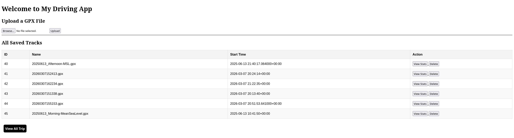
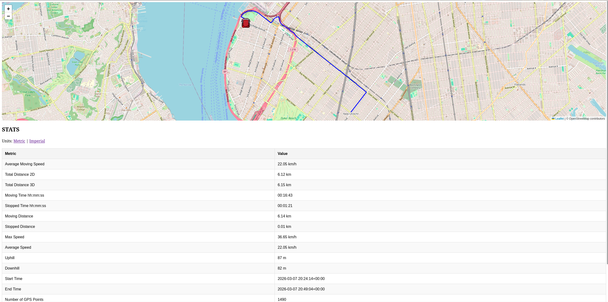
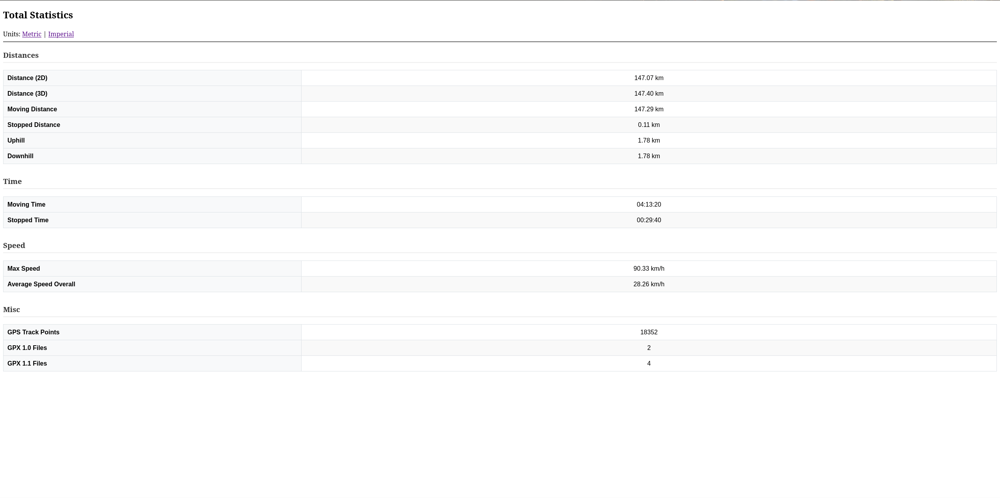

[](https://opensource.org/licenses/)
# Driving Stats

A Python app that read and parses GPX files, stores data in a databse and display statistics for the given data.


## Features

- Simple Web UI
- Plot the GPS data in a map
- Store original GPX files
- Calculate Statistics (distance, average speed, etc..)
- Store GPS data in a database
- Supports GPX 1.0 and 1.1 Files 


## Run Locally

Clone the project

```bash
  git clone https://github.com/Spulp45/cisc4900.git
```

Go to the project directory

```bash
  cd cisc4900
```

## (Mac/Linux)

Create Python Virtual Environment 

```bash
  python -m venv .venv
```
Activate Virtual Environment 

```bash
  source .venv/bin/activate
```

Install Required Libraries

```bash
  pip install -r requirements.txt
```

Run the app with 

```bash
  python ./main.py
```

Now you should see this in the terminal:
> **Note:** Port may differ if it’s already in use.
```bash
$ Running on http://127.0.0.1:5000
```
That is where the Web UI is located. Open it to interact with the app.

## Windows

Create Python Virtual Environment 

```bash
  python -m venv .venv
```
Activate Virtual Environment 

```bash
  source .venv\Scripts\activate
```

Install Required Libraries

```bash
  pip install -r requirements.txt
```

Run the app with 

```bash
  python .\main.py
```

Now you should see this in the terminal:
> **Note:** Port may differ if it’s already in use.
```bash
$ Running on http://127.0.0.1:5000
```
That is where the Web UI is located. Open it to interact with the app.


## Usage / Examples

Instructions on how to run are on Run Locally Section

1) Open the Web UI. 
2) You should see a Upload GPX File Section and an empty table.
**Note:** We have provided you with some test files located in the demoGPX folder, you can use these to test the upload and display features of the app.
3) Upload a GPX file, click on the Browse... button and select a GPX file. After making your selection click the Upload Button.
4) Click on the View Stats to display all the data processed from that GPX file.

## Screenshots

## Menu


## Trip overview



## Total Statistics Table

