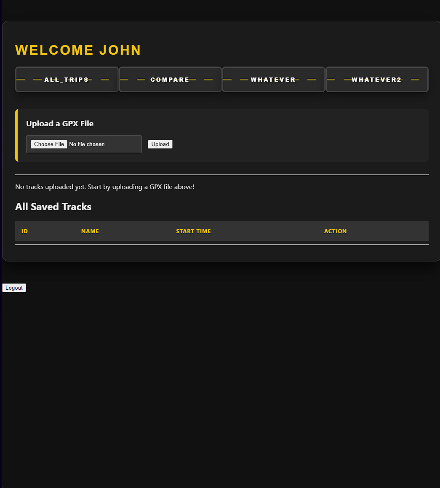
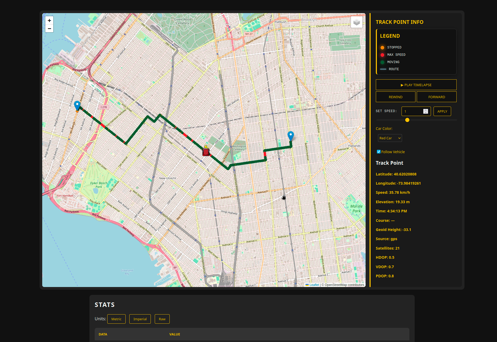
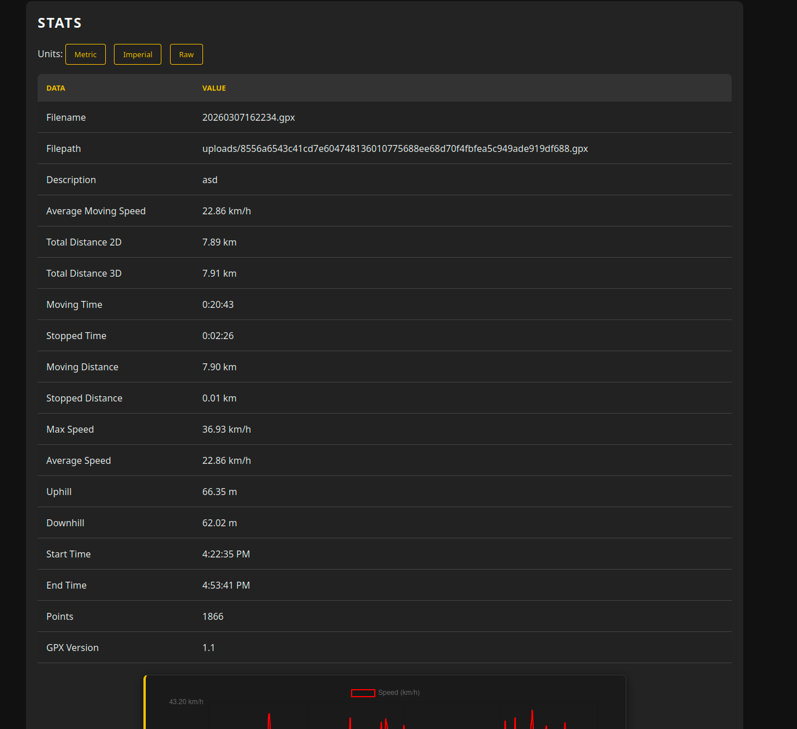
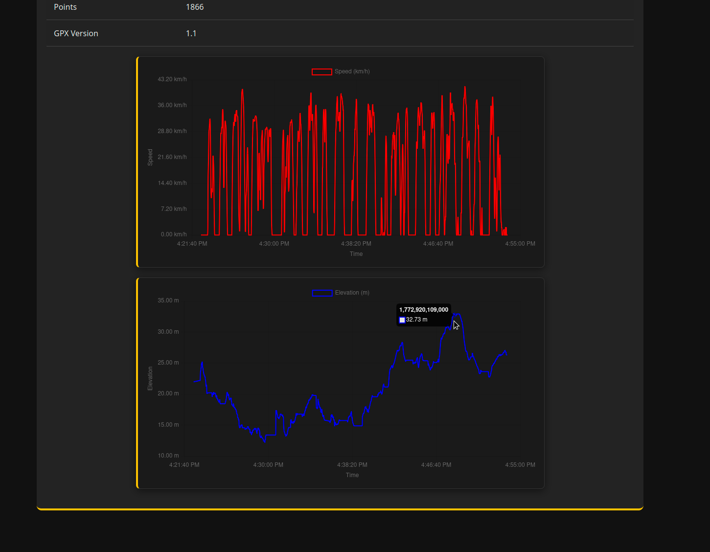
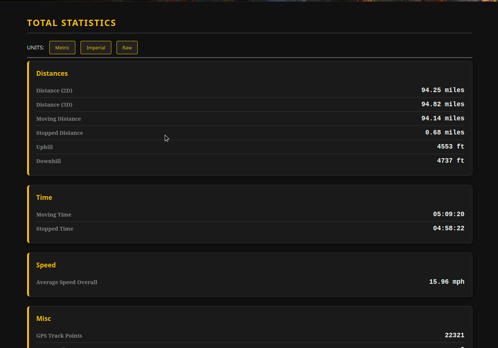
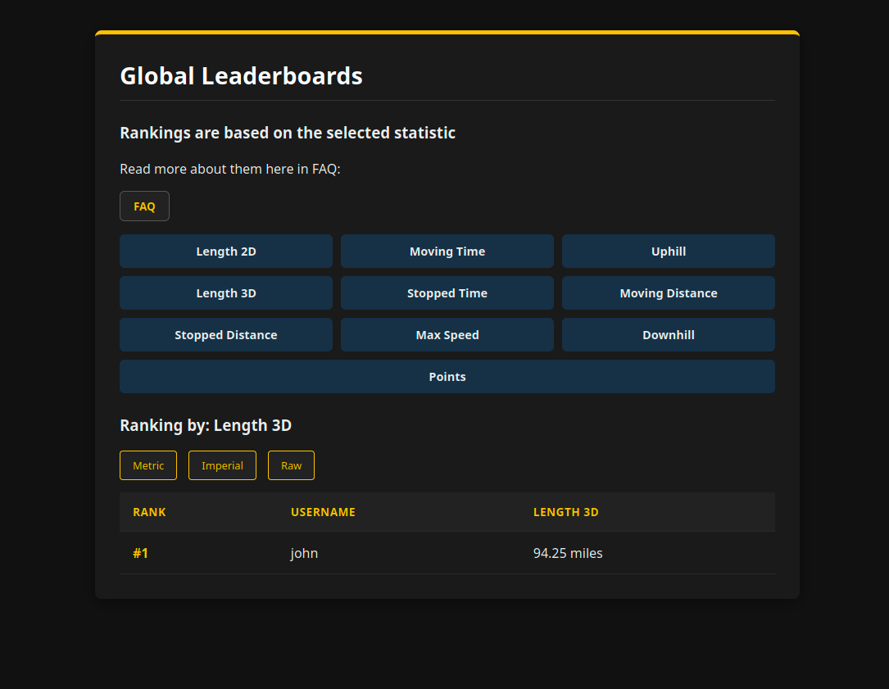
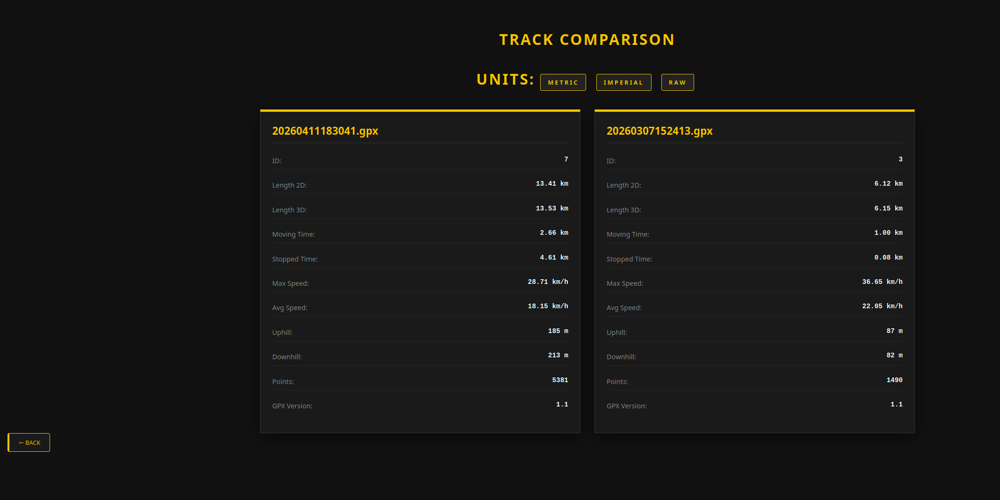
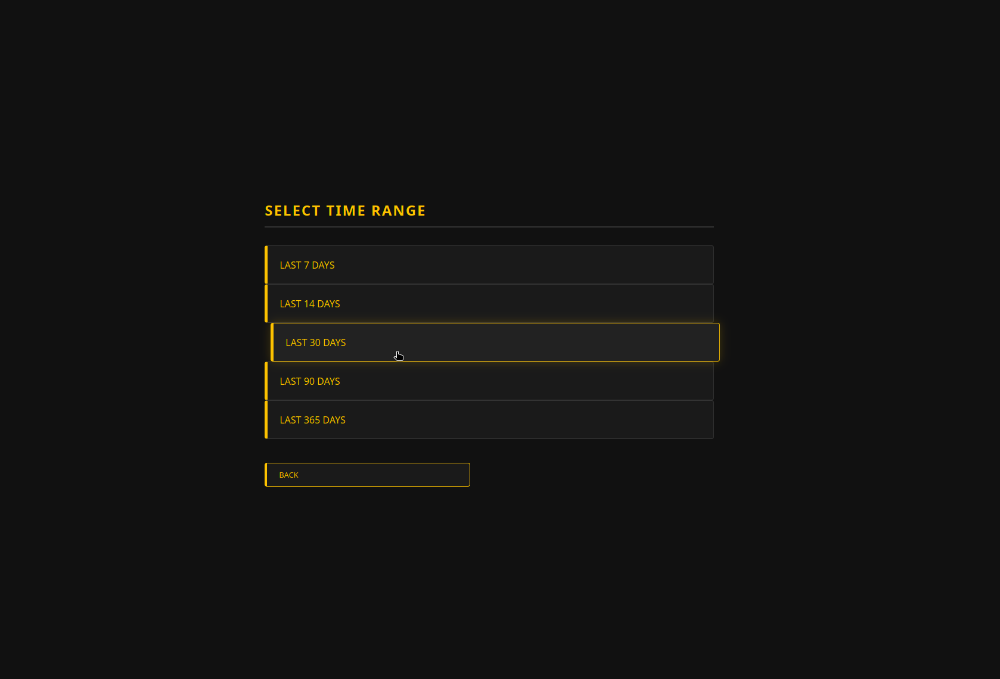
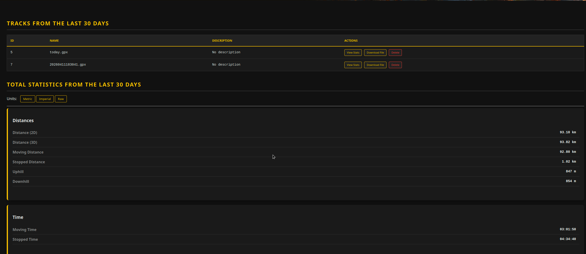

[](https://opensource.org/licenses/)
# Driving Stats

A Python app that reads and parses GPX files, stores data in a database, and displays statistics for the given data.


## Features

- Simple Web UI.
- Plot the GPS data on a map.
- Store original GPX files.
- Calculate Statistics (distance, average speed, etc).
- Store GPS data in a database.
- Supports GPX 1.0 and 1.1 Files.
- Support for multiple users


## Run Locally

Clone the project

```bash
git clone https://github.com/Spulp45/cisc4900.git
```

Go to the project directory

```bash
cd cisc4900
```

## (Mac/Linux)

Create Python Virtual Environment 

```bash
python -m venv .venv
```
Activate Virtual Environment 

```bash
source .venv/bin/activate
```

Install Required Libraries

```bash
pip install -r requirements.txt
```

Run the app with 

```bash
python ./main.py
```

Now you should see this in the terminal:
> **Note:** Port may differ if it’s already in use.
```bash
$ Running on http://127.0.0.1:5000
```
That is where the Web UI is located. Open it to interact with the app.

## Windows

Create Python Virtual Environment 

```bash
python -m venv .venv
```
Activate Virtual Environment 

```bash
.venv\Scripts\activate.bat
```

Install Required Libraries

```bash
pip install -r requirements.txt
```

Run the app with 

```bash
python .\main.py
```

Now you should see this in the terminal:
> **Note:** Port may differ if it’s already in use.
```bash
$ Running on http://127.0.0.1:5000
```
That is where the Web UI is located. Open it to interact with the app.


## Usage / Examples

Instructions on how to run are on Run Locally Section

1) Open the Web UI. 
2) You should see the login screen, choose register if you have not created an username and password yet.
3) After logging in you should see the Main Menu with a table with uploaded tracks and the upload box.
**Note:** We have provided you with some test files located in the demoGPX folder. You can use these to test the upload and display features of the app.
4) Upload a GPX file, click on the Browse... button, and select a GPX file. After making your selection, click the Upload Button.
5) Click on the View Stats to display all the data processed from that GPX file.

## Screenshots

## Menu


## Trip overview



## Overview





## Total Statistics 




## Leaderboard



## Track Comparison Feature



## Misc Screenshots






## Libraries Used

* Leaflet.js https://leafletjs.com/
* Flask https://flask.palletsprojects.com/
* gpxpy https://github.com/tkrajina/gpxpy
* Chart JS https://www.chartjs.org/
* HTMX https://htmx.org/